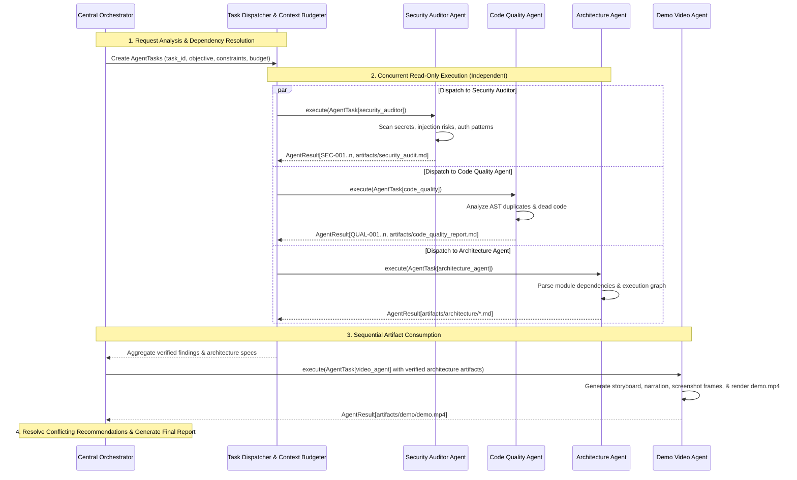

# Agent Interaction & Coordination Protocol

```mermaid
sequenceDiagram
    participant Central as Central Orchestrator
    participant Bus as Task Dispatcher & Context Budgeter
    participant Sec as Security Auditor Agent
    participant Qual as Code Quality Agent
    participant Arch as Architecture Agent
    participant Video as Demo Video Agent

    Note over Central,Bus: 1. Request Analysis & Dependency Resolution
    Central->>Bus: Create AgentTasks (task_id, objective, constraints, budget)

    Note over Bus,Arch: 2. Concurrent Read-Only Execution (Independent)
    par Dispatch to Security Auditor
        Bus->>Sec: execute(AgentTask[security_auditor])
        Sec->>Sec: Scan secrets, injection risks, auth patterns
        Sec-->>Bus: AgentResult[SEC-001..n, artifacts/security_audit.md]
    and Dispatch to Code Quality Agent
        Bus->>Qual: execute(AgentTask[code_quality])
        Qual->>Qual: Analyze AST duplicates & dead code
        Qual-->>Bus: AgentResult[QUAL-001..n, artifacts/code_quality_report.md]
    and Dispatch to Architecture Agent
        Bus->>Arch: execute(AgentTask[architecture_agent])
        Arch->>Arch: Parse module dependencies & execution graph
        Arch-->>Bus: AgentResult[artifacts/architecture/*.md]
    end

    Note over Central,Video: 3. Sequential Artifact Consumption
    Bus-->>Central: Aggregate verified findings & architecture specs
    Central->>Video: execute(AgentTask[video_agent] with verified architecture artifacts)
    Video->>Video: Generate storyboard, narration, screenshot frames, & render demo.mp4
    Video-->>Central: AgentResult[artifacts/demo/demo.mp4]

    Note over Central: 4. Resolve Conflicting Recommendations & Generate Final Report
```
