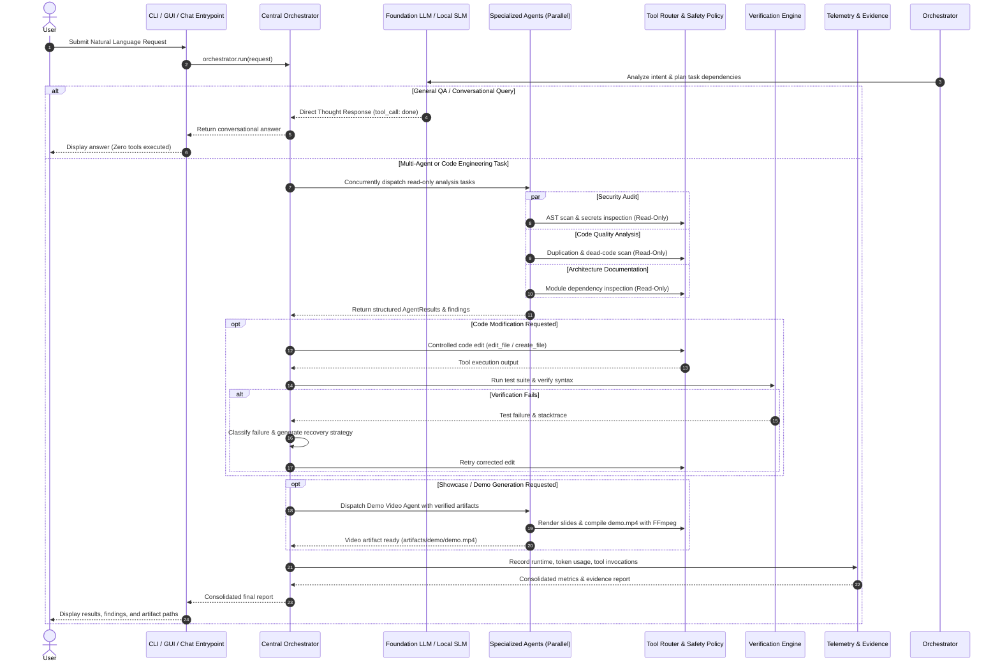

# Runtime Execution Flow

This sequence diagram depicts the end-to-end execution lifecycle when a user submits an engineering or multi-agent request.

```mermaid
sequenceDiagram
    autonumber
    actor User
    participant UI as CLI / GUI / Chat Entrypoint
    participant Orch as Central Orchestrator
    participant LLM as Foundation LLM / Local SLM
    participant Agents as Specialized Agents (Parallel)
    participant Tools as Tool Router & Safety Policy
    participant Verifier as Verification Engine
    participant Telemetry as Telemetry & Evidence

    User->>UI: Submit Natural Language Request
    UI->>Orch: orchestrator.run(request)
    Orchestrator->>LLM: Analyze intent & plan task dependencies

    alt General QA / Conversational Query
        LLM-->>Orch: Direct Thought Response (tool_call: done)
        Orch-->>UI: Return conversational answer
        UI-->>User: Display answer (Zero tools executed)
    else Multi-Agent or Code Engineering Task
        Orch->>Agents: Concurrently dispatch read-only analysis tasks
        par Security Audit
            Agents->>Tools: AST scan & secrets inspection (Read-Only)
        and Code Quality Analysis
            Agents->>Tools: Duplication & dead-code scan (Read-Only)
        and Architecture Documentation
            Agents->>Tools: Module dependency inspection (Read-Only)
        end
        Agents-->>Orch: Return structured AgentResults & findings

        opt Code Modification Requested
            Orch->>Tools: Controlled code edit (edit_file / create_file)
            Tools-->>Orch: Tool execution output
            Orch->>Verifier: Run test suite & verify syntax
            alt Verification Fails
                Verifier-->>Orch: Test failure & stacktrace
                Orch->>Orch: Classify failure & generate recovery strategy
                Orch->>Tools: Retry corrected edit
            end
        end

        opt Showcase / Demo Generation Requested
            Orch->>Agents: Dispatch Demo Video Agent with verified artifacts
            Agents->>Tools: Render slides & compile demo.mp4 with FFmpeg
            Agents-->>Orch: Video artifact ready (artifacts/demo/demo.mp4)
        end

        Orch->>Telemetry: Record runtime, token usage, tool invocations
        Telemetry-->>Orch: Consolidated metrics & evidence report
        Orch-->>UI: Consolidated final report
        UI-->>User: Display results, findings, and artifact paths
    end
```
