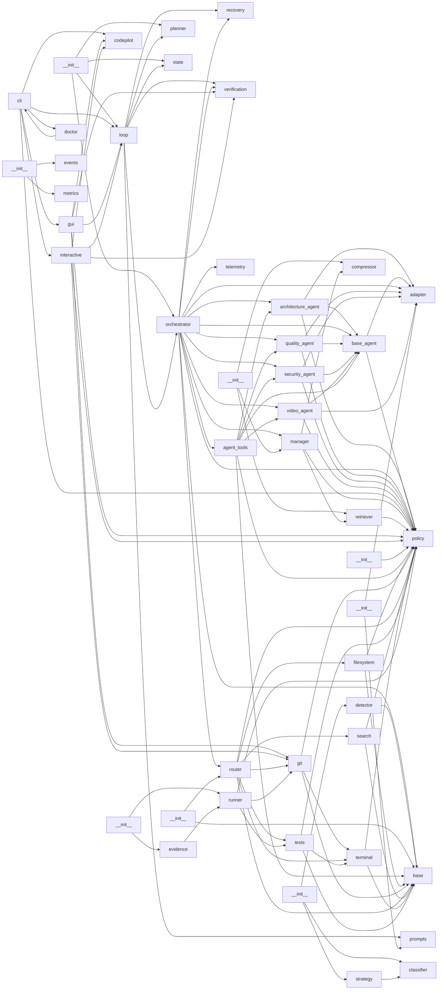

# Module Dependency Graph

```mermaid
graph LR
    codepilot_agent___init__["__init__"]
    codepilot_agent___init__ --> codepilot_agent_loop["loop"]
    codepilot_agent___init__ --> codepilot_agent_orchestrator["orchestrator"]
    codepilot_agent___init__ --> codepilot_agent_planner["planner"]
    codepilot_agent___init__ --> codepilot_agent_state["state"]
    codepilot_agent_architecture_agent["architecture_agent"]
    codepilot_agent_architecture_agent --> codepilot_agent_base_agent["base_agent"]
    codepilot_agent_architecture_agent --> codepilot_llm_adapter["adapter"]
    codepilot_agent_architecture_agent --> codepilot_safety_policy["policy"]
    codepilot_agent_base_agent["base_agent"]
    codepilot_agent_base_agent --> codepilot_llm_adapter["adapter"]
    codepilot_agent_base_agent --> codepilot_safety_policy["policy"]
    codepilot_agent_loop["loop"]
    codepilot_agent_loop --> codepilot_agent_orchestrator["orchestrator"]
    codepilot_agent_loop --> codepilot_agent_planner["planner"]
    codepilot_agent_loop --> codepilot_agent_state["state"]
    codepilot_agent_loop --> codepilot_llm_prompts["prompts"]
    codepilot_agent_loop --> codepilot_recovery["recovery"]
    codepilot_agent_loop --> codepilot_verification["verification"]
    codepilot_agent_orchestrator["orchestrator"]
    codepilot_agent_orchestrator --> codepilot_agent_architecture_agent["architecture_agent"]
    codepilot_agent_orchestrator --> codepilot_agent_base_agent["base_agent"]
    codepilot_agent_orchestrator --> codepilot_agent_quality_agent["quality_agent"]
    codepilot_agent_orchestrator --> codepilot_agent_security_agent["security_agent"]
    codepilot_agent_orchestrator --> codepilot_agent_video_agent["video_agent"]
    codepilot_agent_orchestrator --> codepilot_context_manager["manager"]
    codepilot_agent_orchestrator --> codepilot_llm_adapter["adapter"]
    codepilot_agent_orchestrator --> codepilot_recovery["recovery"]
    codepilot_agent_orchestrator --> codepilot_safety_policy["policy"]
    codepilot_agent_orchestrator --> codepilot_telemetry["telemetry"]
    codepilot_agent_orchestrator --> codepilot_tools_agent_tools["agent_tools"]
    codepilot_agent_orchestrator --> codepilot_tools_base["base"]
    codepilot_agent_orchestrator --> codepilot_tools_router["router"]
    codepilot_agent_orchestrator --> codepilot_verification["verification"]
    codepilot_agent_quality_agent["quality_agent"]
    codepilot_agent_quality_agent --> codepilot_agent_base_agent["base_agent"]
    codepilot_agent_quality_agent --> codepilot_llm_adapter["adapter"]
    codepilot_agent_quality_agent --> codepilot_safety_policy["policy"]
    codepilot_agent_security_agent["security_agent"]
    codepilot_agent_security_agent --> codepilot_agent_base_agent["base_agent"]
    codepilot_agent_security_agent --> codepilot_llm_adapter["adapter"]
    codepilot_agent_security_agent --> codepilot_safety_policy["policy"]
    codepilot_agent_video_agent["video_agent"]
    codepilot_agent_video_agent --> codepilot_agent_base_agent["base_agent"]
    codepilot_agent_video_agent --> codepilot_llm_adapter["adapter"]
    codepilot_agent_video_agent --> codepilot_safety_policy["policy"]
    codepilot_cli["cli"]
    codepilot_cli --> codepilot["codepilot"]
    codepilot_cli --> codepilot_agent_loop["loop"]
    codepilot_cli --> codepilot_gui["gui"]
    codepilot_cli --> codepilot_interactive["interactive"]
    codepilot_cli --> codepilot_llm_doctor["doctor"]
    codepilot_cli --> codepilot_safety_policy["policy"]
    codepilot_context___init__["__init__"]
    codepilot_context___init__ --> codepilot_context_compressor["compressor"]
    codepilot_context___init__ --> codepilot_context_manager["manager"]
    codepilot_context___init__ --> codepilot_context_retriever["retriever"]
    codepilot_context_manager["manager"]
    codepilot_context_manager --> codepilot_context_compressor["compressor"]
    codepilot_context_manager --> codepilot_context_retriever["retriever"]
    codepilot_context_manager --> codepilot_safety_policy["policy"]
    codepilot_context_retriever["retriever"]
    codepilot_context_retriever --> codepilot_safety_policy["policy"]
    codepilot_gui["gui"]
    codepilot_gui --> codepilot["codepilot"]
    codepilot_gui --> codepilot_agent_loop["loop"]
    codepilot_gui --> codepilot_safety_policy["policy"]
    codepilot_gui --> codepilot_tools_git["git"]
    codepilot_gui --> codepilot_verification["verification"]
    codepilot_interactive["interactive"]
    codepilot_interactive --> codepilot["codepilot"]
    codepilot_interactive --> codepilot_agent_loop["loop"]
    codepilot_interactive --> codepilot_safety_policy["policy"]
    codepilot_interactive --> codepilot_tools_git["git"]
    codepilot_interactive --> codepilot_verification["verification"]
    codepilot_llm___init__["__init__"]
    codepilot_llm___init__ --> codepilot_llm_adapter["adapter"]
    codepilot_llm___init__ --> codepilot_llm_prompts["prompts"]
    codepilot_llm_doctor["doctor"]
    codepilot_llm_doctor --> codepilot_cli["cli"]
    codepilot_recovery___init__["__init__"]
    codepilot_recovery___init__ --> codepilot_recovery_classifier["classifier"]
    codepilot_recovery___init__ --> codepilot_recovery_detector["detector"]
    codepilot_recovery___init__ --> codepilot_recovery_strategy["strategy"]
    codepilot_recovery_detector["detector"]
    codepilot_recovery_detector --> codepilot_tools_base["base"]
    codepilot_recovery_strategy["strategy"]
    codepilot_recovery_strategy --> codepilot_recovery_classifier["classifier"]
    codepilot_safety___init__["__init__"]
    codepilot_safety___init__ --> codepilot_safety_policy["policy"]
    codepilot_telemetry___init__["__init__"]
    codepilot_telemetry___init__ --> codepilot_telemetry_events["events"]
    codepilot_telemetry___init__ --> codepilot_telemetry_metrics["metrics"]
    codepilot_tools___init__["__init__"]
    codepilot_tools___init__ --> codepilot_tools_base["base"]
    codepilot_tools___init__ --> codepilot_tools_router["router"]
    codepilot_tools_agent_tools["agent_tools"]
    codepilot_tools_agent_tools --> codepilot_agent_architecture_agent["architecture_agent"]
    codepilot_tools_agent_tools --> codepilot_agent_base_agent["base_agent"]
    codepilot_tools_agent_tools --> codepilot_agent_quality_agent["quality_agent"]
    codepilot_tools_agent_tools --> codepilot_agent_security_agent["security_agent"]
    codepilot_tools_agent_tools --> codepilot_agent_video_agent["video_agent"]
    codepilot_tools_agent_tools --> codepilot_safety_policy["policy"]
    codepilot_tools_agent_tools --> codepilot_tools_base["base"]
    codepilot_tools_filesystem["filesystem"]
    codepilot_tools_filesystem --> codepilot_safety_policy["policy"]
    codepilot_tools_filesystem --> codepilot_tools_base["base"]
    codepilot_tools_git["git"]
    codepilot_tools_git --> codepilot_safety_policy["policy"]
    codepilot_tools_git --> codepilot_tools_base["base"]
    codepilot_tools_git --> codepilot_tools_terminal["terminal"]
    codepilot_tools_router["router"]
    codepilot_tools_router --> codepilot_safety_policy["policy"]
    codepilot_tools_router --> codepilot_tools_base["base"]
    codepilot_tools_router --> codepilot_tools_filesystem["filesystem"]
    codepilot_tools_router --> codepilot_tools_git["git"]
    codepilot_tools_router --> codepilot_tools_search["search"]
    codepilot_tools_router --> codepilot_tools_terminal["terminal"]
    codepilot_tools_router --> codepilot_tools_tests["tests"]
    codepilot_tools_search["search"]
    codepilot_tools_search --> codepilot_safety_policy["policy"]
    codepilot_tools_search --> codepilot_tools_base["base"]
    codepilot_tools_terminal["terminal"]
    codepilot_tools_terminal --> codepilot_safety_policy["policy"]
    codepilot_tools_terminal --> codepilot_tools_base["base"]
    codepilot_tools_tests["tests"]
    codepilot_tools_tests --> codepilot_safety_policy["policy"]
    codepilot_tools_tests --> codepilot_tools_base["base"]
    codepilot_tools_tests --> codepilot_tools_terminal["terminal"]
    codepilot_verification___init__["__init__"]
    codepilot_verification___init__ --> codepilot_verification_evidence["evidence"]
    codepilot_verification___init__ --> codepilot_verification_runner["runner"]
    codepilot_verification_evidence["evidence"]
    codepilot_verification_evidence --> codepilot_verification_runner["runner"]
    codepilot_verification_runner["runner"]
    codepilot_verification_runner --> codepilot_safety_policy["policy"]
    codepilot_verification_runner --> codepilot_tools_git["git"]
    codepilot_verification_runner --> codepilot_tools_tests["tests"]
```
