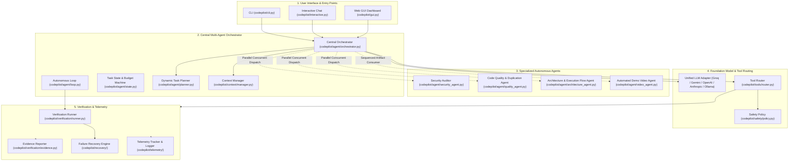

# System Architecture Diagram

```mermaid
graph TD
    subgraph UserInterface ["1. User Interface & Entry Points"]
        CLI["CLI (codepilot/cli.py)"]
        Chat["Interactive Chat (codepilot/interactive.py)"]
        GUI["Web GUI Dashboard (codepilot/gui.py)"]
    end

    subgraph CentralHub ["2. Central Multi-Agent Orchestrator"]
        Orchestrator["Central Orchestrator (codepilot/agent/orchestrator.py)"]
        Loop["Autonomous Loop (codepilot/agent/loop.py)"]
        State["Task State & Budget Machine (codepilot/agent/state.py)"]
        Planner["Dynamic Task Planner (codepilot/agent/planner.py)"]
        Context["Context Manager (codepilot/context/manager.py)"]
    end

    subgraph SpecializedAgents ["3. Specialized Autonomous Agents"]
        SecAgent["Security Auditor (codepilot/agent/security_agent.py)"]
        QualAgent["Code Quality & Duplication Agent (codepilot/agent/quality_agent.py)"]
        ArchAgent["Architecture & Execution Flow Agent (codepilot/agent/architecture_agent.py)"]
        VideoAgent["Automated Demo Video Agent (codepilot/agent/video_agent.py)"]
    end

    subgraph FoundationEngine ["4. Foundation Model & Tool Routing"]
        LLM["Unified LLM Adapter (Groq / Gemini / OpenAI / Anthropic / Ollama)"]
        Tools["Tool Router (codepilot/tools/router.py)"]
        Safety["Safety Policy (codepilot/safety/policy.py)"]
    end

    subgraph VerificationEngine ["5. Verification & Telemetry"]
        Verifier["Verification Runner (codepilot/verification/runner.py)"]
        Evidence["Evidence Reporter (codepilot/verification/evidence.py)"]
        Recovery["Failure Recovery Engine (codepilot/recovery/)"]
        Telemetry["Telemetry Tracker & Logger (codepilot/telemetry/)"]
    end

    CLI --> Orchestrator
    Chat --> Orchestrator
    GUI --> Orchestrator

    Orchestrator --> Context
    Orchestrator --> Planner
    Orchestrator --> LLM

    Orchestrator -. Parallel Concurrent Dispatch .-> SecAgent
    Orchestrator -. Parallel Concurrent Dispatch .-> QualAgent
    Orchestrator -. Parallel Concurrent Dispatch .-> ArchAgent
    Orchestrator -. Sequenced Artifact Consumer .-> VideoAgent

    Orchestrator --> Tools
    Tools --> Safety
    Tools --> VerificationEngine
    Loop --> Verifier
    Verifier --> Recovery
    VerificationEngine --> Evidence
    VerificationEngine --> Telemetry
```
